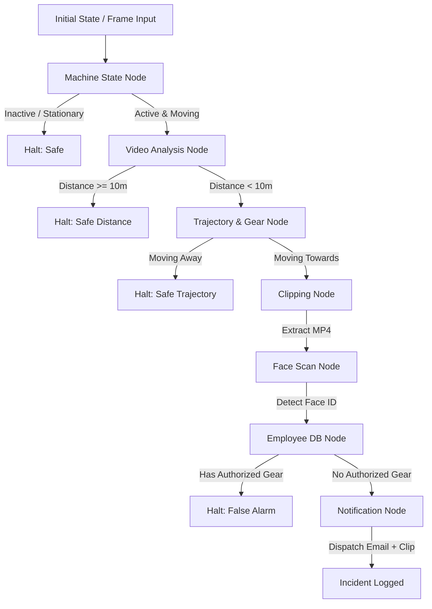

# HaloCAS Technical Architecture

This document maps out the system architecture and the lifecycle of a single camera frame as it traverses the HaloCAS logic pipeline.

## Component Flowchart

The system is designed as a pipeline where data traverses conditionally through specific nodes. Each node represents an isolated block of business logic.

## Directory Structure Breakdown

- **`src/core/workflow.py`**: The main entry point. Defines the execution logic and orchestrates how state is passed from node to node.
- **`src/nodes/logic.py`**: Contains the individual Python functions representing the nodes in our flowchart. Each node returns a boolean instructing the graph whether to continue or halt, along with the modified state payload.
- **`src/data/mock_db.json`**: Acts as a stand-in for a live SQL/NoSQL employee database.
